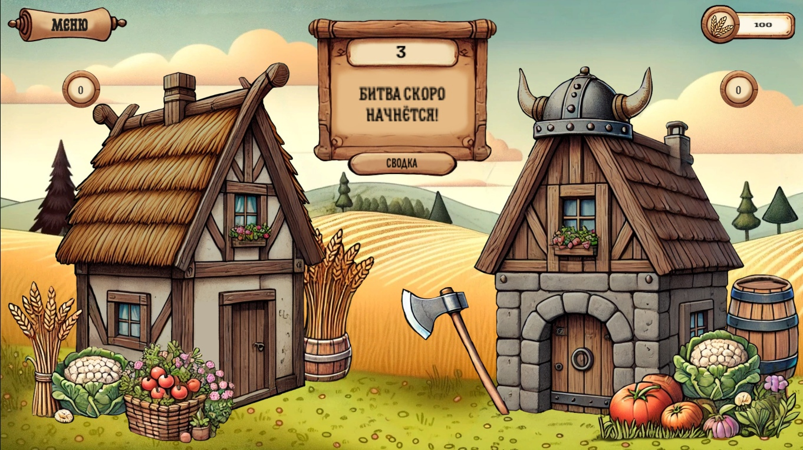
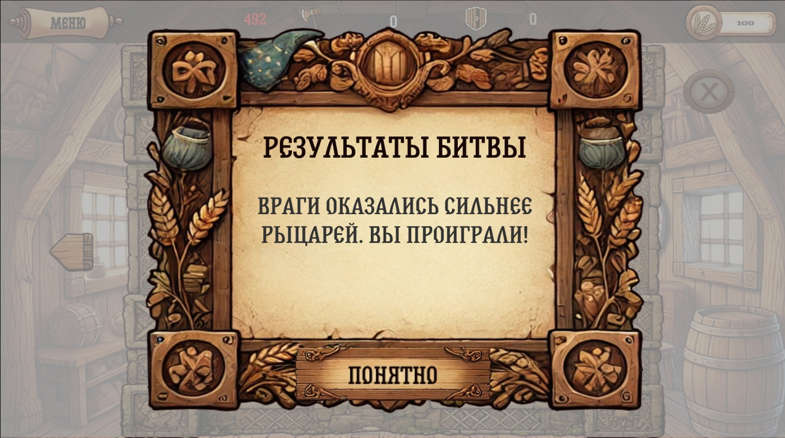
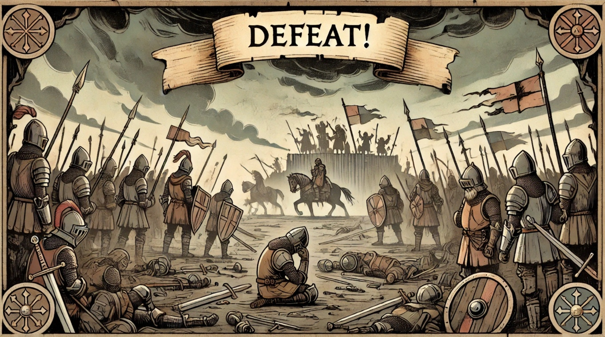

# Save the Village

**Switch Language / Переключить язык:**
- [English Version](README-ENG.md) - [Русская версия](README.md)

**Save the Village** is my first project on Unity, and I've put a lot of effort into it! This is a strategy game where you must defend a village from barbarians and prevent famine.

## Description
- Train knights to protect the village from barbarians.
- Train peasants to harvest wheat.
- Collect 1,000 units of wheat to save the village and achieve the happy ending.

## Three Possible Endings:
1. **Good Ending**: You saved the village by gathering enough resources.
2. **Defeated by Barbarians**: Not enough defenders.
3. **Death by Famine**: Insufficient resources for survival.

## Features
- Unique artwork created using AI and tailored to match the game’s style.
- Balanced gameplay with strategic elements.
- An exciting challenge of resource and troop management.

## Important
This is my first Unity project, so there might be some bugs or flaws, but I’ve worked hard to make it as engaging and enjoyable as possible. I hope you’ll like it!

### Screenshot 1

### Screenshot 2

### Screenshot 3

### Screenshot 4

### Screenshot 5

### Screenshot 6

