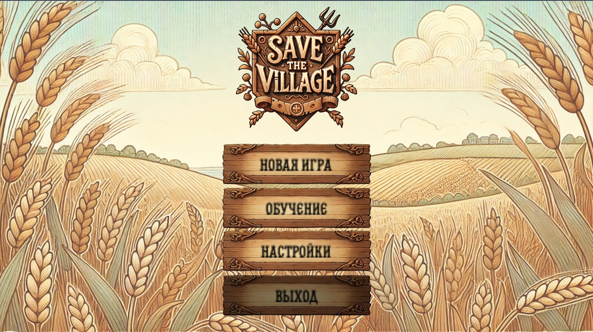
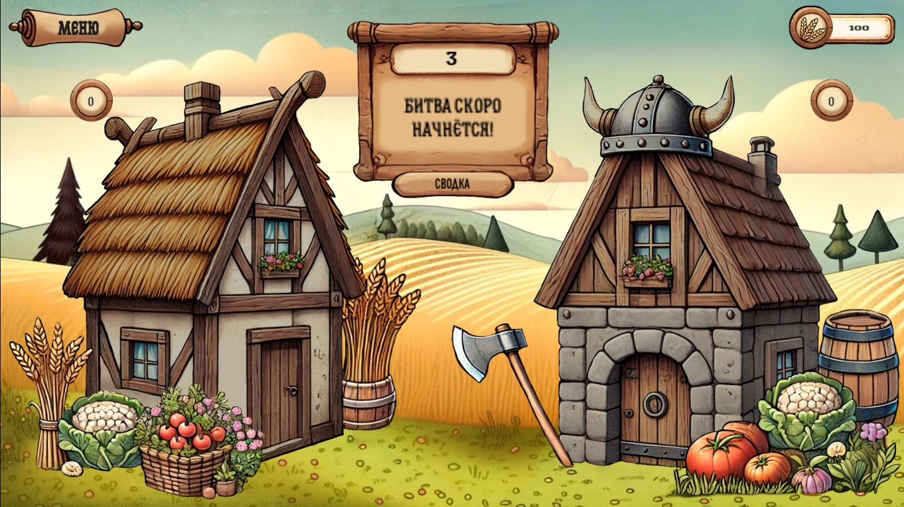
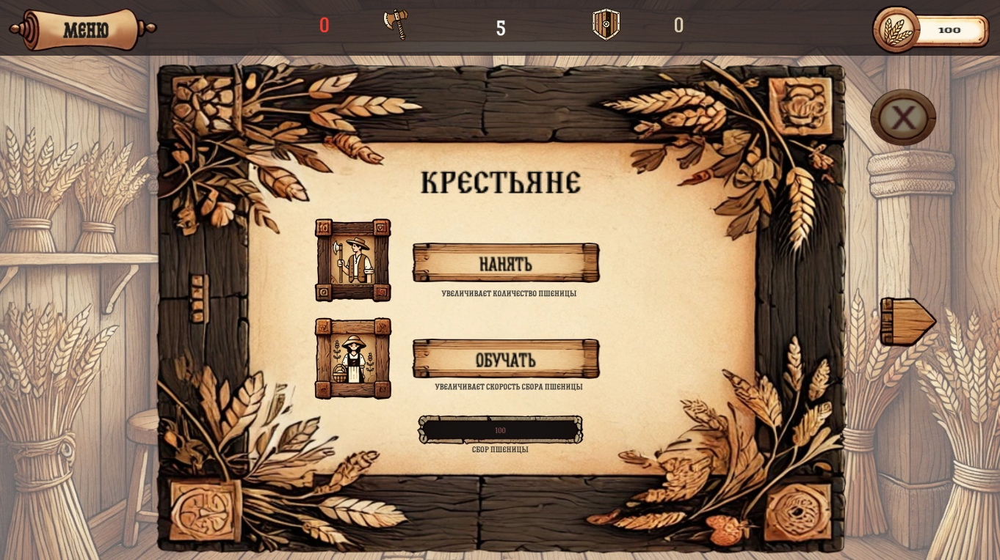
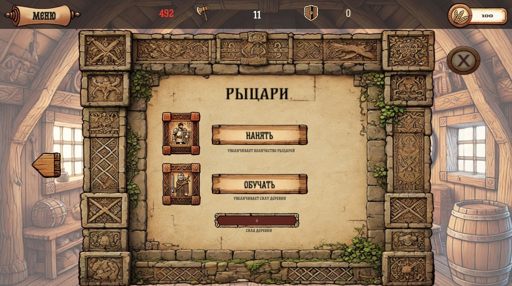
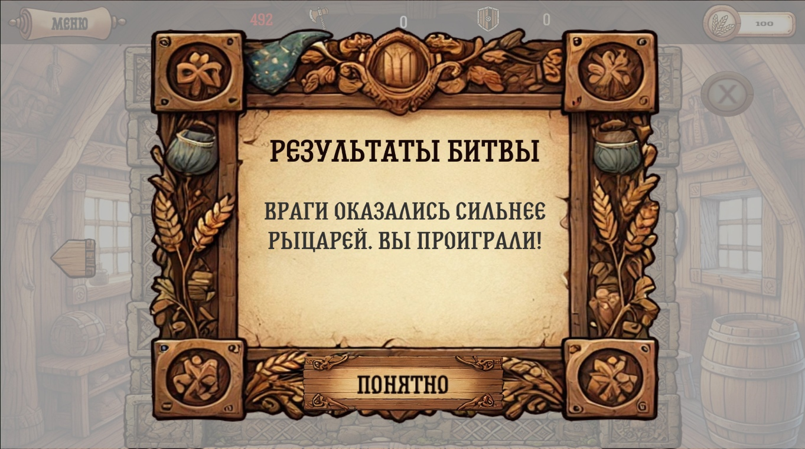
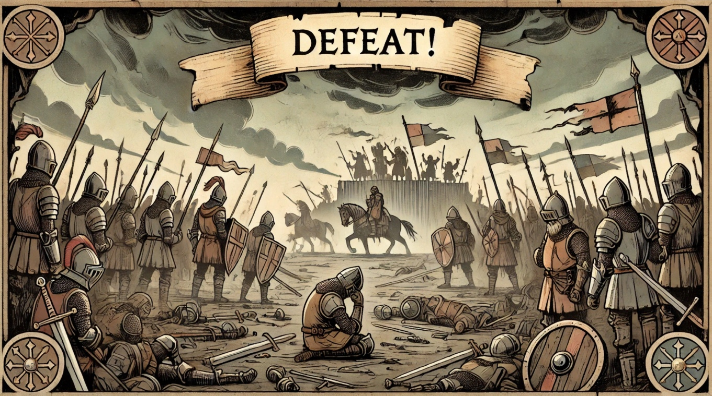

# Save the Village

**Switch Language / Переключить язык:**
- [English Version](README-ENG.md) - [Русская версия](README.md)

**Save the Village** — мой первый проект на Unity, и я вложила в него много усилий! Это стратегическая игра, в которой вам предстоит защитить деревню от варваров и предотвратить голод.

## Описание
- Обучайте рыцарей, чтобы они защищали деревню от варваров.
- Обучайте крестьян, чтобы они добывали пшеницу.
- Наберите 1000 единиц пшеницы, чтобы спасти деревню и достичь счастливой концовки.

## Три возможных финала:
1. **Хорошая концовка**: Вы спасли деревню, набрав достаточно ресурсов.
2. **Смерть от варваров**: Защитников оказалось недостаточно.
3. **Смерть от голода**: Недостаточно ресурсов для выживания.

## Особенности
- Уникальные арты, созданные с помощью нейросети и подогнанные под стиль игры.
- Сбалансированный геймплей с элементами стратегии.
- Захватывающее испытание на управление ресурсами и войсками.

## Важно
Это мой первый проект на Unity, поэтому могут быть ошибки или недочёты, но я старалась сделать его максимально интересным и увлекательным. Надеюсь, вам понравится!

### Скриншот 1

### Скриншот 2

### Скриншот 3

### Скриншот 4

### Скриншот 5

### Скриншот 6

